# Architecture

## System diagram

```mermaid
flowchart TB
    subgraph EXT["External services"]
        WOO["WooCommerce store<br/>(REST API + webhooks)"]
        TBC["TBC Bank gateway"]
        PP["PayPal"]
        META["Facebook / Instagram<br/>(posts, ads, Messenger)"]
        WA["WhatsApp Business Cloud"]
        MAIL["Email (SMTP/IMAP)"]
        COUR["Couriers: local Tbilisi /<br/>Georgian Post / DHL"]
        ALI["Supplier feeds (Alibaba CSV)"]
        NBG["NBG FX rates"]
    end

    subgraph MAKE["Make.com"]
        subgraph BUS["Message bus"]
            HOOK{{"Webhooks"}}
            TQ[("Task Queue<br/>Data Store")]
        end

        CEO["🧠 01 CEO Router<br/>(orchestrator, Claude)"]
        FIELD["📦 02 Order → Fulfillment<br/>(Field agent)"]
        SUP["💬 03 Support Inbox Triage<br/>(Admin Supervisor)"]
        DIG["☀️ 04 Daily Digest 08:00"]
        ENG["🔧 05 Store Maintenance<br/>(Chief Engineer)"]
        CFO["📊 06 CFO Weekly Mon 09:00"]
        ACC["🧾 07 Nightly Reconciliation 23:00<br/>(Accountant)"]
        MKT["📣 08 Marketing Daily 10:00"]

        subgraph STORES["Agent memory (Data Stores)"]
            DS1[("Orders")]
            DS2[("SKU / Inventory")]
            DS3[("Customers / Threads")]
            DS4[("CEO Memory / OKRs")]
        end

        GATE{{"🔐 Approval gate<br/>(Telegram buttons → webhook)"}}
        ERR["🚨 Error routes<br/>3× exp. backoff"]
    end

    subgraph GS["Google Sheets — long-term memory"]
        BRAIN["Company Brain<br/>(Decisions, Policies, Suppliers)"]
        PNL["P&L snapshot"]
        LED["Ledger + VAT export"]
        INC["Incidents"]
    end

    OWNER(("👤 Human owner<br/>(only authority above CEO)"))

    WOO -->|order webhooks| HOOK
    TBC & PP -->|payment webhooks| HOOK
    WA & MAIL & META -->|messages| HOOK
    ALI --> ENG
    NBG --> CFO

    HOOK --> CEO
    CEO <--> TQ
    CEO -->|route_task| FIELD & SUP & ENG & CFO & ACC & MKT
    FIELD & SUP & ENG & CFO & ACC & MKT -->|results / escalations| CEO

    FIELD --> COUR
    FIELD -->|tracking msg| WA & MAIL
    SUP -->|replies| WA & MAIL & META
    ENG -->|products, stock| WOO
    MKT -->|scheduled posts| META
    MKT -->|campaign emails| MAIL
    ACC --> LED
    CFO --> PNL
    CEO & SUP & ENG --> BRAIN
    ERR --> INC
    INC --> ENG

    CEO -->|>500 GEL / money / ads| GATE
    GATE <--> OWNER
    DIG --> OWNER

    FIELD <--> DS1
    ENG <--> DS2
    SUP <--> DS3
    CEO <--> DS4
```

## Orchestration spec (concrete)

**Message bus.** Every event is an HTTP POST to the CEO Router webhook with the
Task Queue envelope: `task_id, from_agent, to_agent, type, payload_json,
status, priority (1=urgent…5=low), created_at, deadline`. The router persists
the task, asks the CEO brain, and dispatches to the target agent's webhook.
Agent scenarios post results/escalations back the same way — no agent calls
another agent directly; the CEO router is the single hub. Scenario 01 runs in
**sequential** mode so tasks are processed in order.

**Agent brains.** One Anthropic Claude "Create a Message" module per agent
scenario, `model: claude-sonnet-4-6`, system prompt = `00-shared-conventions.md`
+ the agent's file, user message = the JSON task envelope. Output is parsed by
a JSON module; a parse failure error-routes into a `claude-haiku-4-5` repair
call ("output only corrected JSON"), then re-parses.

**Approval gates.** Any `needs_approval: true`, `request_human_approval`
action, amount > 500 GEL, ad spend > 200 GEL/day, or (first 30 days) any
money/ads/bulk-email action → Telegram message to the owner containing two
webhook links (approve/reject). A 3-module gate scenario (webhook → update
Task Queue status → repost `approval_decision` to the CEO router) closes the
loop. Nothing executes until the decision event arrives.

**Memory.** Short-term: one Data Store per domain (Task Queue, Orders,
SKU/Inventory, Customers, CEO Memory). Long-term: the "Company Brain" Google
Sheet (Decisions, Policies, Suppliers, Prices) that agents append to and the
CEO reads for the digest.

**Error handling.** Every Claude/HTTP module carries an error route:
`Add Row → Incidents sheet` + a **Break** handler (retries: 3, interval:
exponential starting 1 min). Open incidents are polled by scenario 05 and fed
to the Chief Engineer agent, which classifies retry/remap/patch and escalates
repeats to the CEO.

**Scheduling (Asia/Tbilisi).**

| Scenario | Schedule |
|---|---|
| 04 Daily Digest | daily 08:00 |
| 06 CFO Weekly | Monday 09:00 |
| 08 Marketing Daily | daily 10:00 |
| 07 Nightly Reconciliation | daily 23:00 |
| 05 Store Maintenance sync | daily 06:00 (+ webhook for errors) |
| SLA watchdog | every 15 min, business hours |
